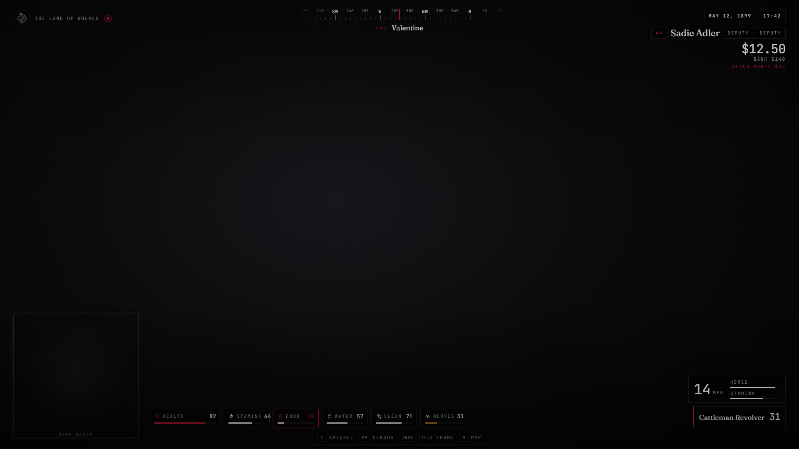
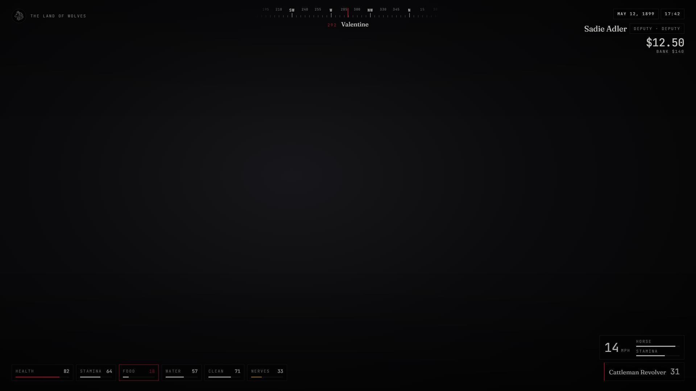
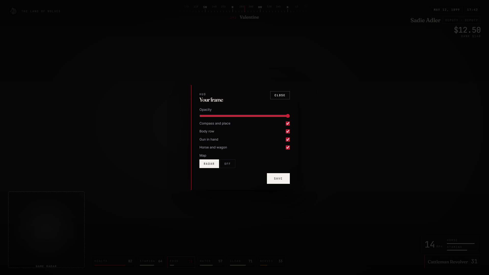
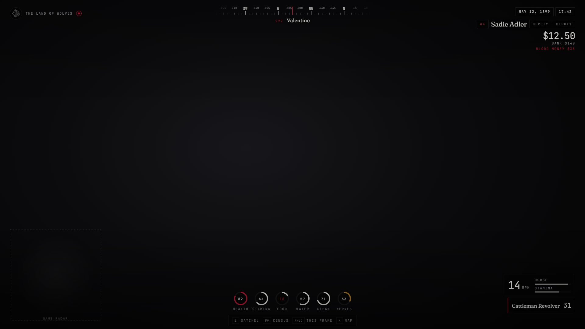
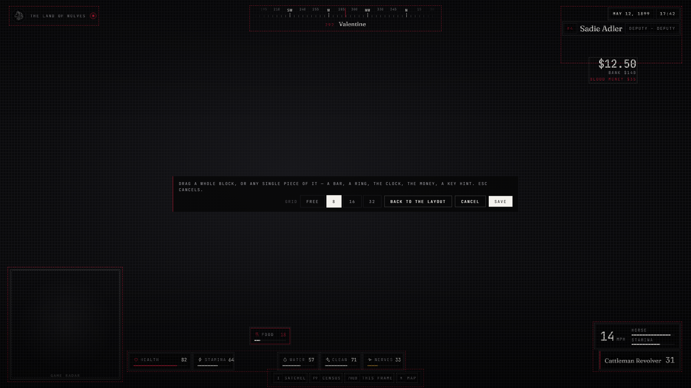

# lxr-hud — HUD & needs for LXRCore

The frame around the world: a compass strip with the nearest place, the hour
and the date in the server year, name and trade, cash and bank, the body
(health, stamina, food, water, cleanliness, nerves), the gun in hand and the
horse under you. It also owns the needs: they decay on the server, every core
catalog item with `effects` restores them, and the values live in the core's
replicated state bags so any resource can read them.



| Radar off — the body row takes the corner | Your frame — the settings page (`/hud`) |
|---|---|
|  |  |
| **Rings** style, compact layout | **Edit layout** — drag every block |
|  |  |

The dashed square in the first shot stands where the game draws its radar; the HUD itself never draws a map.

## What it does

* **Compass** — a scrolling heading tape (cardinal points, 15° minors), the
  heading in degrees and the nearest place from `Config.Places`.
* **Clock & identity** — game hour, game date in `Config.Layout.year`,
  character name, trade and grade, cash and bank.
* **Body row** — six meters in the order of `Config.Layout.status`; food and
  water blink under `Config.Needs.warnAt`; starving deals damage every
  `starve.everyMs` while a need sits at zero.
* **Weapon & mount** — the gun in hand with its rounds; speed (mph or km/h)
  and the horse's health and stamina cores when mounted; wagons show speed.
* **Needs on the server** — hunger, thirst and cleanliness fall per tick
  (faster while riding or running), nerves fall on their own; `SetNeed`,
  `AddNeed`, `AddStress`, `RemoveStress`, `GetNeed` exports for other resources.
* **Consumables** — every catalog item with `effects` (food, drink, tonics,
  tobacco, medicine) is registered as usable: animation and prop by the
  catalog's `use.anim`, a cancellable progress bar through lxr-nui, charges
  for refillables (canteen), then the effects land — needs on the server,
  health / stamina / cores on the client. Horse feed stays with lxr-horses.
* **Temperature** — the game's reading at the character + the warmth of what is worn + a recent drink, by the clock; cold and heat change how fast hunger and thirst fall, freezing hurts. `Config.Temperature`.
* **Flies · drink · leftovers** — a swarm follows the unwashed; spirits raise a `drunk` need that brings the game's drunk post-fx and a heavy walk; a bottle stays behind (`use.gives`).
* **Nerves** — camera shakes by bracket; shooting adds stress when enabled.
* **Settings** — `/hud` opens a panel (opacity, compass, body row, weapon,
  mount, radar) persisted per client; `/togglehud` hides everything.
* **Themes** — LXR Night / LXR Morning from the core's `Config.UI.theme`.
* **Cost** — one 250 ms loop while shown, diffed so the page only redraws
  what changed; nothing runs while hidden.

## Your frame (`/hud`)

Everything a player can change is saved per client:

* **Layout** presets (classic, compact, cinematic) and **Edit layout** — drag a whole block or any single piece of it (a bar, a ring, the clock, the money, the gun panel, a key hint, the radar frame) where you want it, on a snapping grid (free / 8 / 16 / 32 px); arrow keys nudge the last piece by 1, Shift+arrows by 10; offsets are kept per piece.
* **Body row** — every core has its icon; bars or rings.
* **Body row style** — bars or rings; **size** and **opacity** of the whole frame; **cinema bars** with a height.
* **What is shown** — compass, clock, name, money, body row, gun, horse, key hints, voice light, server id, trade, bank, blood money.
* **Map** — the game's radar on or off (the body row moves out of its corner automatically).
* **Frame code** — export your layout as a code, paste a friend's.

## Building the interface

The frame is a Vite + React + TypeScript bundle: source in `ui/`, built output in `html/` (`cd ui && npm install && npm run build`). `style.css` uses kit tokens only; `tools/kit_check.py` guards it.

## Install

```cfg
ensure lxr-core
ensure lxr-nui
ensure lxr-hud
```

No SQL: needs are metadata the core already persists.

## Configuration

`config.lua` — `Config.Lang`, `Config.Layout`, `Config.Settings`,
`Config.Places`, `Config.Needs`, `Config.Consumables`, `Config.Stress`,
`Config.Security`.

## API

| Name | Side | Purpose |
|---|---|---|
| `GetNeed(src, key)` / `SetNeed(src, key, value)` / `AddNeed(src, key, delta)` | server | hunger · thirst · cleanliness · stress |
| `AddStress(src, n)` / `RemoveStress(src, n)` | server | nerves |
| `lxr:needs:consumed` (src, item, effects) | server | emitted after a consumable landed |
| `Hide(on)` / `IsShown()` / `GetSnapshot()` | client | other resources hide the frame or read what it shows |
| `LocalPlayer.state.hunger / thirst / cleanliness / stress` | client | the core's replicated values |

## Licence

© 2026 iBoss21 / LXRCore — All Rights Reserved. See `LICENSE`.
